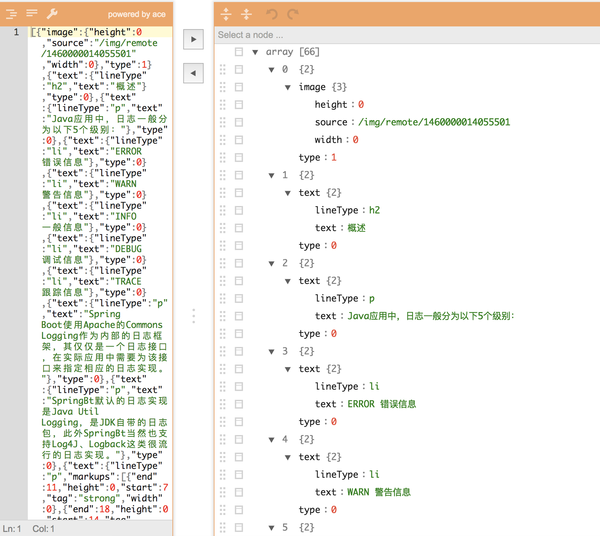

# HAML

## What is HAML ?

HAML is the JSON style markup language for describing article body.  

* HAML stands for Hyper Article Markup Language
* HAML elements are the building blocks of Article pages
* HAML content can be auto generate by HTML
* Different sides(Android/iOS/Web) can parse HAML to render it as a native page

## Usage

```java
String html = "<h1>My First Heading</h1><li><a href=\"/about\">My first paragraph.</a></li>";
Haml.parse(html);
```

```bash
[
 {"text":{"lineType":"h1","text":"My First Heading"},"type":0},
 {"text":{"lineType":"li","text":"My first paragraph."},"type":0,
             "markups":[{"end":19,"height":0,"source":"/about","start":0,"tag":"a","width":0}]}
]
```

## Support

### HAML Element

* Text
* Image
* Table

## Art 

Original Article: 


HAML: 



## Thanks

* [QingMang's RAML](https://github.com/qingmang-team/docs/blob/master/raml/intro.md)

## License

Apache License Version 2.0  

Copyright (c) 2018-present, GavinLiu
